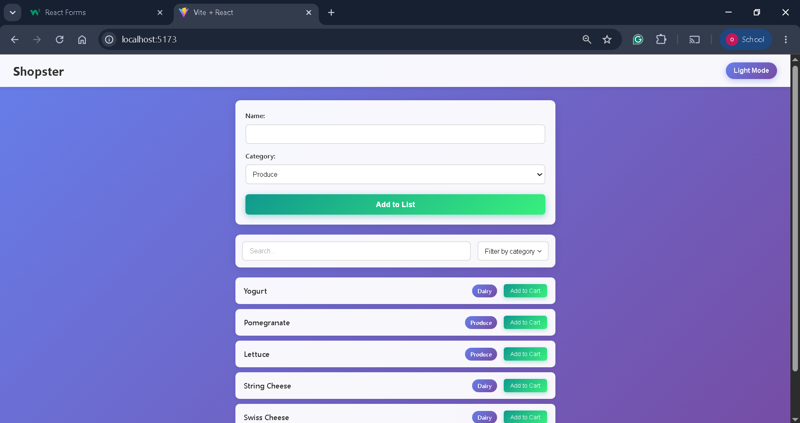
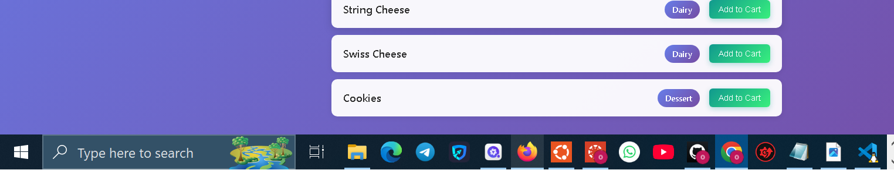
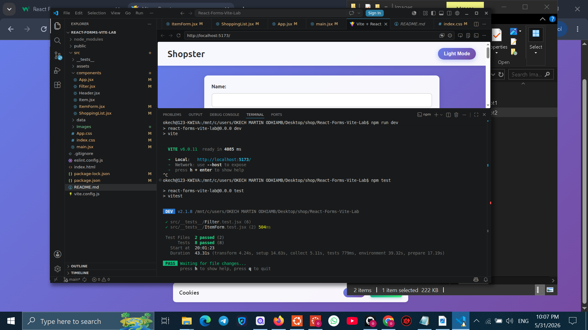

# React Controlled Components Lab

## Learning Goals

- Implement a controlled form

## Introduction
## 🎓 Key React Concepts Demonstrated

1. **Controlled Components**: Form inputs tied to React state
2. **State Lifting**: Search state lives in `ShoppingList`, passed to `Filter`
3. **Callback Props**: `onSearchChange`, `onItemFormSubmit` for child→parent communication
4. **Immutable Updates**: `[...items, newItem]` instead of `items.push()`
5. **Derived State**: `itemsToDisplay` computed from `items`, `searchTerm`, `selectedCategory`
6. **Event Handling**: `onSubmit`, `onChange`, `onClick` with proper binding## 🎓 Key React Concepts Demonstrated

1. **Controlled Components**: Form inputs tied to React state
2. **State Lifting**: Search state lives in `ShoppingList`, passed to `Filter`
3. **Callback Props**: `onSearchChange`, `onItemFormSubmit` for child→parent communication
4. **Immutable Updates**: `[...items, newItem]` instead of `items.push()`
5. **Derived State**: `itemsToDisplay` computed from `items`, `searchTerm`, `selectedCategory`
6. **Event Handling**: `onSubmit`, `onChange`, `onClick` with proper binding

In this lab, you'll write and use controlled components.





## 🎯 Features
- ✅ Controlled search input with real-time filtering
- ✅ Category dropdown filter
- ✅ Add new items via controlled form
- ✅ Dark/Light mode toggle
- ✅ Add/Remove items from cart

## 🚀 Getting Started

```bash
# Install dependencies
npm install

# Run all tests
npm test

# Start the Vite dev server
npm run dev

# Open in browser (usually http://localhost:5173)
# Initialize Git (if not already)
git init
git add .
git commit -m "feat: add controlled search and item form components

- Implement controlled search input with dynamic filtering
- Add ItemForm with controlled inputs for name/category
- Filter items by both category AND search term
- Pass callbacks via props: onSearchChange, onItemFormSubmit
- All tests passing"

# Push to your remote (optional)
git remote add origin https://github.com/YOUR_USERNAME/your-repo.git
git push -u origin main

## Resources

- [React Forms](https://facebook.github.io/react/docs/forms.html)


# 📄 LICENSE (MIT License)
MIT License
Copyright (c) 2026 [OKECH MARTIN]
Permission is hereby granted, free of charge, to any person obtaining a copy
of this software and associated documentation files (the "Software"), to deal
in the Software without restriction, including without limitation the rights
to use, copy, modify, merge, publish, distribute, sublicense, and/or sell
copies of the Software, and to permit persons to whom the Software is
furnished to do so, subject to the following conditions:
The above copyright notice and this permission notice shall be included in all
copies or substantial portions of the Software.
THE SOFTWARE IS PROVIDED "AS IS", WITHOUT WARRANTY OF ANY KIND, EXPRESS OR
IMPLIED, INCLUDING BUT NOT LIMITED TO THE WARRANTIES OF MERCHANTABILITY,
FITNESS FOR A PARTICULAR PURPOSE AND NONINFRINGEMENT. IN NO EVENT SHALL THE
AUTHORS OR COPYRIGHT HOLDERS BE LIABLE FOR ANY CLAIM, DAMAGES OR OTHER
LIABILITY, WHETHER IN AN ACTION OF CONTRACT, TORT OR OTHERWISE, ARISING FROM,
OUT OF OR IN CONNECTION WITH THE SOFTWARE OR THE USE OR OTHER DEALINGS IN THE
SOFTWARE.